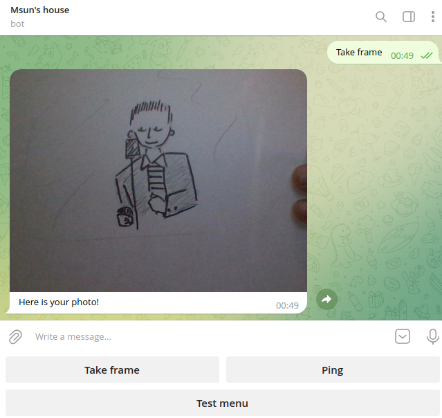

# PyTelegram home camera

## Table of Contents

- [About](#about)
- [Getting Started](#getting_started)
- [Usage](#usage)
- [Contributing](#contributing)

## About <a name = "about"></a>

Little telegram bot written using telebot library for communicating and cv2 lib as image grabber. Made this thing because im too scared to leave my house alone :) Bot only answers to user whose ID you set in settings.py. 

### Screenshots




## Getting Started<a name = "getting_started"></a>

*something about git clone...*
```
git clone https://github.com/MsUn-123/tg_camera
cd tg_camera
```

*something about virtual environment and requirements...*
```
virtualenv .venv
source .venv/bin/activate
pip install -r requerments.txt
```

## Usage <a name = "usage"></a>

Create `settings.py` file with variables:
```
key = <your bots' API key>
host = <your telegram profile ID>
```

To start a bot use: 
```
python bot.py
```
From there use `/start` command and use menu buttons!

## Contributing <a name = "contributing"></a>

Feel free to contribute! Any help is apreciated and it will help me to learn new things!
